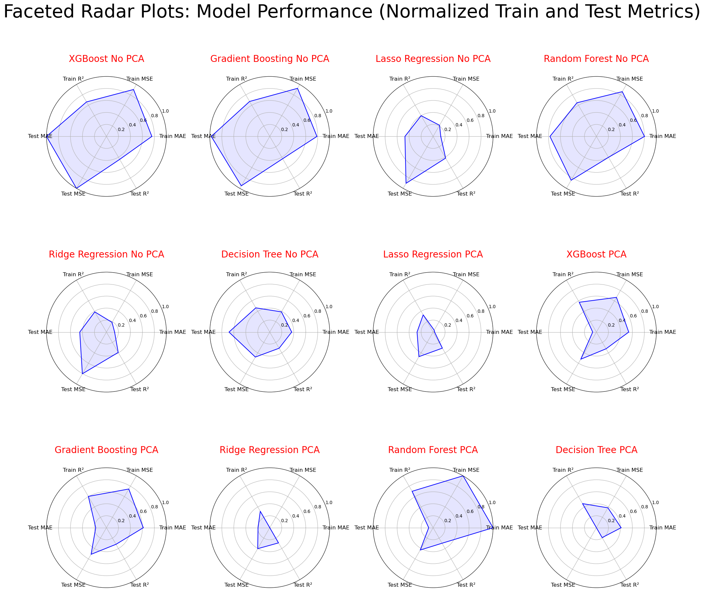

# XoX Price Prediction Model

A comprehensive machine learning project for predicting XoX product prices using multiple regression algorithms and ensemble methods.

## Project Overview

As an agency helping customers purchase XoX products from various makers, price estimation is critical for making informed purchasing decisions. This project develops and compares multiple machine learning models to accurately predict XoX prices based on product characteristics, dimensions, and other features.

## Business Context

Our agency needs to estimate XoX prices before purchase to:
- Recommend products at optimal price points
- Identify pricing trends across different makers
- Make data-driven purchasing decisions
- Understand which features most influence pricing

## Dataset

The project uses sales data containing the following features:

**Numerical Features:**
- `cost` - Production cost
- `weight` - Product weight
- `height`, `width`, `depth` - Product dimensions
- `volume` - Calculated as height × width × depth

**Categorical Features:**
- `product_type` - Type classification (can be multi-valued)
- `product_level` - Product tier/level
- `maker` - Manufacturer name
- `ingredients` - Product composition (can be multi-valued)

**Temporal Features:**
- `purchase_date` - Date of purchase
- Derived: `year`, `month`, `weekday`, `day`

**Target Variable:**
- `price` - XoX product price

## Machine Learning Models

The project implements and compares the following regression models:

### Individual Models
1. **Linear Regression** - Baseline linear model
2. **Ridge Regression** - L2 regularization
3. **Lasso Regression** - L1 regularization with feature selection
4. **PLS Regression** - Partial Least Squares regression
5. **Random Forest Regressor** - Ensemble of decision trees
6. **Gradient Boosting Regressor** - Sequential boosting algorithm
7. **XGBoost Regressor** - Optimized gradient boosting

### Ensemble Model
8. **Stacking Regressor** - Meta-model combining top performers

## Project Structure

```
Price_predictor/
├── README.md                           # Project documentation
├── requirements.txt                    # Python dependencies
├── regression modeling.ipynb           # Main analysis notebook
├── data/
│   └── sample_data.csv                # Sample dataset
├── results/                            # Model performance visualizations
│   ├── performance.png                # Radar plots of all models
│   └── stacking regressor.png         # Stacking Regressor predictions
└── XoX_Price_Prediction_Model.pptx    # Project presentation
```

## Key Features

### 1. Data Preprocessing & Cleaning
- Custom transformation functions for price, cost, and dimension conversions
- Handling of multi-valued categorical features
- Missing value imputation strategies
- Feature engineering including volume calculation

### 2. Feature Engineering
- Temporal feature extraction (year, month, weekday, day)
- Volume calculation from dimensions
- Numerical feature scaling using MinMaxScaler
- Categorical encoding with OneHotEncoder
- Custom text processing for multi-valued categories

### 3. Model Training & Evaluation
- Cross-validation for robust performance estimation
- Hyperparameter tuning using GridSearchCV
- Comprehensive metrics: MAE, MSE, RMSE, R²
- Composite scoring system for model comparison

### 4. Visualization
- Distribution analysis of features and target
- Correlation heatmaps
- Model performance comparison charts
- Radar plots for multi-metric evaluation
- Prediction vs actual plots

## Installation

### Prerequisites
- Python 3.8 or higher
- Jupyter Notebook

### Setup

1. Clone the repository:
```bash
git clone https://github.com/sys0507/Price-Predictor.git
cd Price-Predictor
```

2. Install required packages:
```bash
pip install -r requirements.txt
```

3. Launch Jupyter Notebook:
```bash
jupyter notebook
```

4. Open `regression modeling.ipynb` and run all cells

## Usage

### Running the Analysis

1. **Data Loading**: The notebook loads data from `data/sample_data.csv`
2. **Preprocessing**: Automatic data cleaning and transformation
3. **Model Training**: All models are trained with optimized hyperparameters
4. **Evaluation**: Comprehensive performance metrics are calculated
5. **Visualization**: Results are visualized in multiple formats

### Modifying for Your Data

To use your own sales data:
1. Format your data to match the expected schema (see Dataset section)
2. Place your CSV file in the `data/` folder
3. Update the file path in the notebook (Cell 1)
4. Run all cells

## Model Performance

The notebook includes detailed performance comparisons across all models using:
- **Train/Test MAE** - Mean Absolute Error
- **Train/Test MSE** - Mean Squared Error
- **Train/Test R²** - Coefficient of Determination
- **Composite Score** - Weighted metric combining all measures

Performance visualizations include:
- Bar charts comparing metrics across models
- Normalized heatmaps for multi-metric view
- Stacked and individual radar plots
- Actual vs Predicted scatter plots

## Technical Implementation

### Pipeline Architecture
```python
Pipeline([
    ('preprocessor', ColumnTransformer([
        ('numerical', MinMaxScaler(), numerical_features),
        ('categorical', OneHotEncoder(), categorical_features),
        ('temporal', StandardScaler(), temporal_features)
    ])),
    ('regressor', Model())
])
```

### Hyperparameter Tuning
Each model undergoes GridSearchCV optimization with model-specific parameter grids to find optimal configurations.

### Stacking Strategy
The Stacking Regressor combines top-performing base models with a meta-learner to achieve superior prediction accuracy.

## Results

### Model Performance Comparison

The following radar plots show the normalized performance metrics (MAE, MSE, R²) for all models across both training and test sets:



**Key Observations:**
- XGBoost and Gradient Boosting show the most balanced performance across all metrics
- Random Forest demonstrates strong R² scores on both train and test sets
- Lasso Regression shows signs of underfitting with lower overall performance
- Models with PCA show different metric patterns compared to non-PCA versions

### Stacking Regressor Performance

The Stacking Regressor combines the best-performing models to achieve superior prediction accuracy:


**Performance Highlights:**
- Strong correlation between predicted and actual prices on both train and test sets
- Good generalization with similar performance patterns across train/test splits
- Effective handling of the full price range from low to high-cost products

### Model Insights

The notebook provides comprehensive analysis including:
- Feature importance rankings
- Temporal price trends
- Categorical feature impact analysis
- Model strengths and weaknesses
- Recommendations for production deployment

## Future Enhancements

Potential improvements include:
- Deep learning models (Neural Networks)
- Additional feature engineering
- Time series forecasting components
- Automated feature selection
- Model interpretability tools (SHAP, LIME)
- Deployment as REST API

## Contributing

Contributions are welcome! Please feel free to submit a Pull Request.

## License

This project is open source and available for educational and commercial use.

## Author

Created by [sys0507](https://github.com/sys0507)

## Acknowledgments

- Techlent ML Camp for project guidance
- Scikit-learn and XGBoost teams for excellent ML libraries
- The open-source community for tools and inspiration

---

**Note**: The current `sample_data.csv` is placeholder data. For actual price predictions, please use real XoX sales data formatted according to the schema described above.
